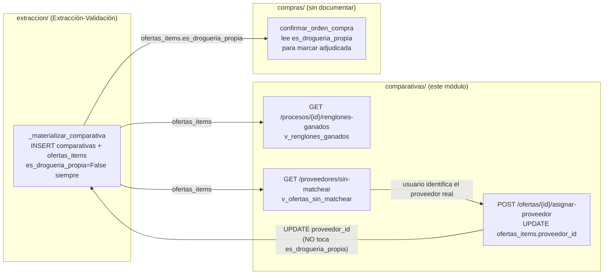

# Arquitectura — Comparativas

## Posición en el pipeline

Este módulo no produce datos propios: es una capa de lectura curada (2 vistas SQL) más
un ajuste manual acotado (`asignar_proveedor`), intercalada entre dos módulos que sí
tienen lógica de negocio real.



`asignar_proveedor` es el único punto de escritura de todo el módulo: vincula
`ofertas_items.proveedor_id` a un `proveedores.id` real, para que una oferta que llegó
como texto libre (`ofertas_items.proveedor`, columna `TEXT NOT NULL`, ver
[`base_de_datos.md`](./base_de_datos.md)) quede asociada a una fila real del catálogo
de proveedores. No toca `es_drogueria_propia` — ver la sección siguiente.

## Las 2 vistas SQL de origen

Ambas están definidas en `docs/schema/extractor_final.sql` con
`ALTER VIEW ... SET (security_invoker = on)` (`extractor_final.sql:1710,1712`), lo que
significa que corren con los privilegios del rol que consulta, no del creador — cuando
`router.py` las consulta con `user_client` (`router.py:25,33`), la RLS de las tablas
subyacentes (`comp_sel`/`oi_sel` sobre `comparativas`/`ofertas_items`,
`docs/schema/rls_final.sql:270,276`, ambas `USING mismo_tenant(drogueria_id)`) se
aplica igual que si se consultara la tabla directamente. Esto explica por qué ninguno
de los 2 endpoints `GET` de este módulo necesita una validación de tenant inline en el
router (a diferencia del `POST`, ver [`reglas.md`](./reglas.md)
RN-COMPARATIVAS-002): el filtrado por droguería ya lo hace Postgres.

### `v_renglones_ganados` (`extractor_final.sql:1576-1595`)

```sql
CREATE VIEW v_renglones_ganados AS
SELECT
    c.proceso_comercial_id,
    proc.nombre                 AS proceso,
    cl.nombre                   AS cliente,
    oi.id                       AS oferta_item_id,
    oi.renglon_id,
    oi.descripcion,
    oi.precio_unitario,
    oi.cantidad_ofertada,
    oi.adjudicada               AS ganado_oficial,
    oi.adjudicacion_estimada    AS ganado_estimado,
    CASE WHEN oi.adjudicada THEN 'oficial'
         WHEN oi.adjudicacion_estimada THEN 'estimado' END AS nivel
FROM ofertas_items oi
JOIN comparativas c            ON c.id = oi.comparativa_id AND c.es_vigente = TRUE
JOIN procesos_comerciales proc ON proc.id = c.proceso_comercial_id
LEFT JOIN clientes cl          ON cl.id = proc.cliente_id
WHERE oi.es_drogueria_propia = TRUE
  AND (oi.adjudicada OR oi.adjudicacion_estimada);
```

Propósito declarado en el comentario del schema (`extractor_final.sql:1575`):
"Renglones ganados (oficial o estimado) para anticipar compras". Solo muestra ofertas
de la **propia** droguería (`es_drogueria_propia = TRUE`) que además ganaron (oficial o
estimado), y solo de la versión **vigente** de cada comparativa (`c.es_vigente = TRUE`)
— una oferta de una comparativa reemplazada nunca aparece acá, sin importar su
`adjudicada`/`adjudicacion_estimada`.

### `v_ofertas_sin_matchear` (`extractor_final.sql:1612-1622`)

```sql
CREATE VIEW v_ofertas_sin_matchear AS
SELECT
    oi.proveedor AS texto_crudo,
    c.drogueria_id,
    COUNT(*)     AS apariciones,
    COUNT(*) FILTER (WHERE oi.adjudicada) AS veces_ganador
FROM ofertas_items oi
JOIN comparativas c ON c.id = oi.comparativa_id
WHERE oi.proveedor_id IS NULL AND oi.es_drogueria_propia = FALSE
GROUP BY oi.proveedor, c.drogueria_id
ORDER BY apariciones DESC;
```

Propósito declarado en el comentario del schema (`extractor_final.sql:1611`):
"Proveedores sin matchear". Agrupa por el texto crudo del proveedor
(`oi.proveedor`, la columna `TEXT` que llenó IA/CSV) y cuenta apariciones y veces que
ganó, para priorizar a qué texto crudo conviene asignarle un `proveedor_id` real vía
`POST /ofertas/{id}/asignar-proveedor`. A diferencia de `v_renglones_ganados`, esta
vista **no** filtra por `c.es_vigente` — cuenta apariciones en todas las versiones de
todas las comparativas, no solo la vigente.

## Relación con `extraccion_validacion/` (productor de datos)

Documentado en detalle en
[`../extraccion_validacion/flujo.md`](../extraccion_validacion/flujo.md) Flujo 2 —no se
repite acá. Los puntos relevantes para este módulo:

- Toda fila de `ofertas_items` nace con `es_drogueria_propia = False` fijo
  (`extraccion/service.py:220`, RN-EXTRACCIONVALIDACION-005) y `proveedor_id = NULL`
  (no se setea explícitamente en el `INSERT`, columna `NULL` por definición de schema,
  `extractor_final.sql:588`).
- `posicion_precio`/`adjudicacion_estimada` los calcula `_computar_posiciones`
  (`extraccion/service.py:96-109`) inmediatamente después del `INSERT`, antes de que
  este módulo pueda leer nada.
- `adjudicada` (adjudicación **oficial**, distinta de la estimada) no la escribe
  `extraccion/` — la escribe `compras/confirmar_orden_compra`
  (`compras/service.py:112-141`), fuera del alcance de esta documentación.

## Hallazgo cruzado: `compras/` depende de un campo que ningún módulo audita puede setear en `True`

`compras/service.py:130` (`confirmar_orden_compra`) solo marca una oferta como
`adjudicada = True` si `oferta.get("es_drogueria_propia")` es verdadero. El comentario
en ese mismo archivo (`compras/service.py:127-129`) es explícito:

> "§5: solo las ofertas PROPIAS ganadoras se marcan adjudicada=TRUE. es_drogueria_propia
> hoy no se auto-detecta (ver matching de comparativas) así que en la práctica esto no
> dispara hasta que exista el PATCH manual de asignación — comportamiento esperado."

Ese comentario da a entender que existe (o existirá) un "PATCH manual de asignación"
que resuelve `es_drogueria_propia`. `Grep` de `es_drogueria_propia` en los 4 archivos
de este módulo (el único candidato razonable para ese "PATCH manual", dado que es el
único caso de escritura sobre `ofertas_items` fuera de `extraccion/`) da **cero
resultados** de escritura: `asignar_proveedor` (`service.py:23-25`) solo actualiza
`proveedor_id`. Es decir, el "PATCH manual" que el comentario de `compras/` da por
sentado **no existe en este módulo ni en ningún otro auditado en esta sesión** — ver
[`pendientes.md`](./pendientes.md) para el detalle del impacto.

## Patrón `service_client` / `user_client`

Igual que el resto de los módulos de `presupuestacion/`, el router nunca importa
`get_service_client` directamente. `asignar_proveedor_para_endpoint`
(`service.py:28-33`) es el único punto que lo resuelve, con el motivo en su propio
docstring: "la RLS de ofertas_items no incluye 'superadmin' en UPDATE — mismo criterio
que el resto de los módulos, el router nunca importa el service client"
(`service.py:29-30`). Confirmado contra el schema real:
`docs/schema/rls_final.sql:278` (`oi_upd`) —
`(select get_rol()) IN ('admin','gerencia','lider_comercial','comercial')`, sin
`superadmin`.

`router.py` sí usa `get_user_client` (`router.py:12,25,33,43`) para los 3 endpoints:
en los 2 `GET`, es el único cliente usado (las vistas aplican RLS solas, ver arriba);
en el `POST`, se usa además para el `SELECT` de verificación de pertenencia de
droguería antes de delegar en `asignar_proveedor_para_endpoint` — ver
[`reglas.md`](./reglas.md) RN-COMPARATIVAS-002.
