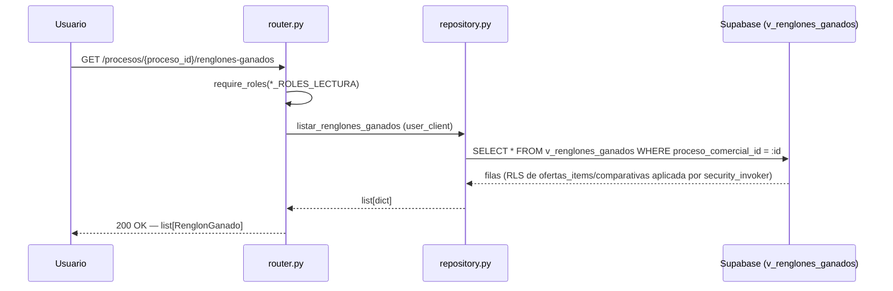
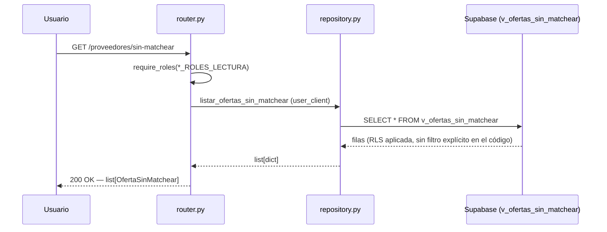
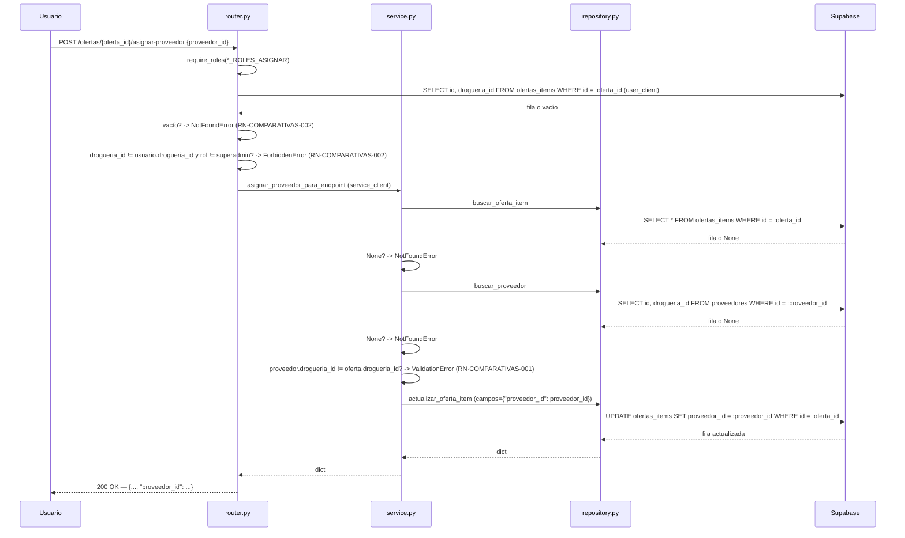

# Flujos — Comparativas

## Flujo 1 — Consultar renglones ganados

Sin lógica de negocio: `router.py:21-27` llama directo a `repo.listar_renglones_ganados`,
sin pasar por `service.py` (este flujo no tiene caso de uso propio, solo una lectura
filtrada). El escopeo por droguería del solicitante no lo hace el código Python — lo
hace Postgres vía RLS, porque la vista corre con `security_invoker = on` y el cliente
usado es `user_client` (RLS-aware). Ver [`arquitectura.md`](./arquitectura.md).

## Flujo 2 — Consultar ofertas sin matchear

Idéntico patrón al Flujo 1 (`router.py:30-35`), sin ningún parámetro de entrada — la
vista ya agrupa por `drogueria_id` internamente (`GROUP BY oi.proveedor,
c.drogueria_id`, `extractor_final.sql:1621`), así que un usuario con RLS activa solo ve
las filas de su propia droguería aunque el `SELECT` de Python no tenga `.eq()`.

## Flujo 3 — Asignar proveedor manualmente

Pasos, con evidencia de código:

1. El router verifica rol habilitado (`_ROLES_ASIGNAR`, `router.py:42`).
2. Con `user_client` (RLS-aware), busca la oferta por `id` (`router.py:45-51`) — si no
   existe → `NotFoundError("No se encontró la oferta")` (`router.py:52-53`).
3. Si el usuario no es `superadmin` y la droguería de la oferta no coincide con la del
   usuario → `ForbiddenError("La oferta no pertenece a tu droguería")`
   (`router.py:56-57`, RN-COMPARATIVAS-002).
4. Delega en `asignar_proveedor_para_endpoint` (`router.py:59`), que resuelve
   `get_service_client()` y llama a `asignar_proveedor` (`service.py:28-33`).
5. `asignar_proveedor` (`service.py:10-25`) vuelve a buscar la oferta, esta vez con
   `service_client` y trayendo todas las columnas (`repo.buscar_oferta_item`,
   `service.py:13`) — si no existe → `NotFoundError` (`service.py:14-15`). Esta
   segunda búsqueda es redundante con la del router en cuanto a existencia (el router
   ya confirmó que existe bajo RLS), pero necesaria porque el router solo trajo `id,
   drogueria_id`, no la fila completa que `service.py` necesita para comparar contra
   el proveedor.
6. Busca el proveedor por `id` (`service.py:17`) — si no existe → `NotFoundError`
   (`service.py:18-19`).
7. Compara `proveedor["drogueria_id"]` contra `oferta["drogueria_id"]` — si difieren →
   `ValidationError` (`service.py:20-21`, RN-COMPARATIVAS-001).
8. Actualiza `ofertas_items.proveedor_id` (`service.py:23-25`) y retorna la fila
   actualizada completa (`repository.py:24-33`, `.data[0]`).

**Lo que este flujo NO hace**: no toca `es_drogueria_propia` en ningún paso — ver
[`arquitectura.md`](./arquitectura.md) y [`pendientes.md`](./pendientes.md). No
registra nada en `historial_cambios` — sin llamada a `core.audit` en todo el módulo.
