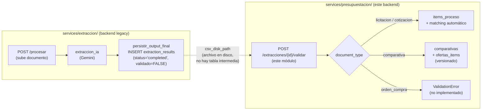

# Arquitectura — Extracción-Validación

## El flujo cross-backend

Este módulo es la segunda mitad de un flujo que cruza los dos backends del monorepo:



El único punto de contacto entre ambos backends es la fila de `extraction_results`
(schema de `presupuestacion/`, escrita por el backend legacy con `service_role`) y el
CSV que esa fila referencia en disco (`csv_disk_path`). Ninguno de los dos backends
persiste las filas extraídas (`rows`) en una tabla intermedia — ver
[`../extraccion_api/reglas.md`](../extraccion_api/reglas.md) RN-EXTRACCIONAPI-003 del
lado productor, y `_leer_filas_csv` (`service.py:24-26`) del lado consumidor, que abre
el mismo `csv_disk_path` con `csv.DictReader(..., delimiter=";")`.

Este módulo es puramente consumidor de esa fila: no la crea, no sube archivos, no
invoca IA. Su única escritura sobre `extraction_results` es el `UPDATE` final que la
marca como validada (`repository.py:24-33`, invocado en `service.py:292-296`).

## Branching por `document_type`

`validar_extraccion` (`service.py:244-305`) es el único caso de uso del módulo. Todo
el comportamiento diferente por tipo de documento vive en un único `if/elif/else`
(`service.py:270-289`):

- `document_type in {"licitacion", "cotizacion"}` (constante
  `_TIPOS_ITEMS_PROCESO`, `service.py:19`) → `_materializar_licitacion`
  (`service.py:61-93`): crea filas en `items_proceso` y dispara matching automático
  por cada una.
- `document_type == "comparativa"` → `_materializar_comparativa`
  (`service.py:137-241`): crea una fila en `comparativas` (con versionado si ya
  existe una vigente) y N filas en `ofertas_items`, calcula posición de precio y
  notifica si hubo reemplazo.
- Cualquier otro valor (hoy solo `orden_compra`, el cuarto valor de `DocumentType`,
  `models.py:5`) → `ValidationError` explícita (`service.py:286-289`) — ver
  [`reglas.md`](./reglas.md) RN-EXTRACCIONVALIDACION-002.

El comentario en `service.py:17-18` documenta por qué `licitacion` y `cotizacion`
comparten la misma rama: "mismo robot de extracción para ambos hoy — la distinción
cotizacion/licitacion vive en `procesos_comerciales.clase`, no acá."

## Dependencia hacia `matching/`

`_materializar_licitacion` (`service.py:61-93`) importa y llama a
`matching.service.procesar_matching_item` (`service.py:15,88-91`) por cada
`item_proceso` recién creado, pasándole `client`, `item`, `drogueria_id` y
`cliente_id` (resuelto de `proceso["cliente_id"]`, `service.py:276`). Es la **única**
dependencia de este módulo hacia un módulo de negocio de otro dominio dentro de
`presupuestacion/` — todas las demás dependencias de este módulo son hacia `core/`.

`matching/` tiene documentación propia en [`../matching/`](../matching/README.md). No
se documenta a fondo acá — solo se deja constancia del acoplamiento; ver
[`../matching/arquitectura.md`](../matching/arquitectura.md) para el flujo
alias-primero-luego-fuzzy y [`../matching/reglas.md`](../matching/reglas.md) para el
umbral de confianza.

`_materializar_comparativa` **no** dispara matching — solo intenta *vincular* cada
oferta a un `item_proceso_id` ya existente por número de renglón
(`items_por_renglon`, `service.py:147-152,204-207`), sin crear ni actualizar
`items_proceso`.

## El bypass de `notificaciones/`

`_notificar_reemplazo_comparativa` (`service.py:112-134`) arma la fila de
notificación en el propio `service.py` y la persiste vía
`repo.crear_notificacion` (`repository.py:101-102`):

```python
def crear_notificacion(client: Client, fila: dict[str, Any]) -> None:
    client.table("notificaciones").insert(fila).execute()
```

Esto es un `INSERT` directo contra la tabla `notificaciones`, **sin pasar** por
`services/presupuestacion/notificaciones/service.py:crear_notificacion`
(`notificaciones/service.py:11-62`), que es la función que:

1. Inserta la notificación (igual que este módulo).
2. Resuelve las preferencias de canal del destinatario
   (`repo.preferencias_de_tipo`, `notificaciones/service.py:45`) o usa
   `CANALES_DEFAULT` si no hay ninguna cargada.
3. Crea una fila en `notificacion_entregas` por cada canal habilitado
   (`notificaciones/service.py:51-60`).

Al bypasear ese flujo, las notificaciones de reemplazo de comparativa que crea este
módulo **nunca generan fila en `notificacion_entregas`** y **no respetan las
preferencias de canal** del usuario — ver detalle de impacto en
[`pendientes.md`](./pendientes.md).

## Patrón `service_client` / `user_client`

Igual que `pricing/`, `matching/` y `presupuestos/`, el router de este módulo nunca
importa el cliente de servicio directamente. `validar_extraccion_para_endpoint`
(`service.py:308-319`) es el único punto que llama a `get_service_client()`, con el
motivo documentado en su propio docstring:

> "Corre con service_role: materializar toca items_proceso/comparativas/ofertas_items/
> notificaciones y dispara matching — mismo criterio que pricing/matching/presupuestos,
> el router nunca importa el service client directamente." (`service.py:311-313`)

`router.py` sí usa `get_user_client` (`router.py:5,20`) — pero solo para el `SELECT`
de verificación de pertenencia de droguería (`router.py:22-28`) **antes** de delegar
en `validar_extraccion_para_endpoint`. Ver [`base_de_datos.md`](./base_de_datos.md)
para el detalle de qué cliente usa cada operación.
