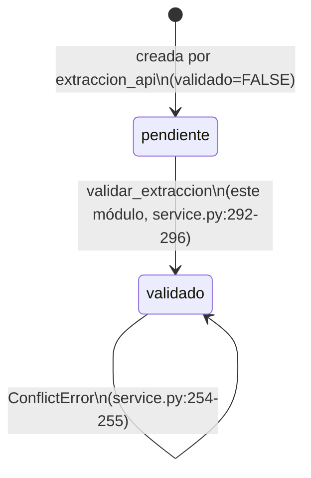

# Estados — `extraction_results.validado` y `comparativas.es_vigente`

Este módulo no define un tipo `Literal`/enum de estados en `models.py` (a diferencia
de `procesos_comerciales.Estado`, ver
[`../procesos_comerciales/estados.md`](../procesos_comerciales/estados.md)). Sin
embargo, sí posee y **hace cumplir en código** dos flags booleanos que funcionan como
máquinas de estado binarias reales — con guarda explícita en al menos uno de los dos
casos — por lo que se documentan acá en vez de omitirse.

## `extraction_results.validado` — pendiente → validado (una sola transición, irreversible)

Columna `BOOLEAN NOT NULL DEFAULT FALSE` (`docs/schema/extractor_final.sql:383`,
comentario de schema: "FALSE = extracción cruda sin revisar. TRUE = un humano validó
y los datos se materializaron en las tablas de negocio", `:394`).

- **Quién la crea en `FALSE`**: el backend legacy `services/extraccion/`, en
  `persistir_output_final` — fuera de este módulo, ver
  [`../extraccion_api/`](../extraccion_api/).
- **Quién la pasa a `TRUE`**: únicamente `validar_extraccion`, al final del caso de
  uso, sin importar qué rama de `document_type` haya tomado
  (`service.py:291-296`) — **excepto** la rama `orden_compra`/no soportada, que
  levanta `ValidationError` antes de llegar a ese punto (ver
  [`flujo.md`](./flujo.md) Flujo 3) y por lo tanto deja la fila en `pendiente`.
- **Guarda de la transición**: `validado == True` al inicio del caso de uso levanta
  `ConflictError("Esta extracción ya fue validada")` (`service.py:254-255`) — no
  existe ningún camino de código en este módulo que revierta `validado` a `FALSE`.
  Confirmado por test `test_validar_ya_validada_levanta_conflict`
  (`tests/extraccion/test_service.py:61-84`).

No existen valores intermedios: es estrictamente `FALSE`/`TRUE`, sin un tercer estado
de "en proceso de validación" (la operación es sincrónica dentro del request HTTP).

## `comparativas.es_vigente` + `version_numero` — versionado, no state machine de negocio

Columna `BOOLEAN NOT NULL DEFAULT TRUE` (`docs/schema/extractor_final.sql:568`). No es
un estado de una entidad individual sino un flag de *vigencia relativa* entre
versiones de la misma cadena (`reemplaza_id` las encadena,
`docs/schema/extractor_final.sql:569,576`):

- Toda comparativa nace `es_vigente=TRUE` (default del schema; este módulo no lo
  escribe explícitamente en el `INSERT`, `service.py:160-172`).
- Cuando este módulo materializa una nueva comparativa para un
  `proceso_comercial_id` que ya tenía una vigente, pasa la anterior a
  `es_vigente=FALSE` (`repo.invalidar_comparativa`, `repository.py:68-69`, llamado en
  `service.py:184`) — la única transición `TRUE -> FALSE` de esta tabla dentro de
  este módulo.
- No hay guarda explícita tipo `ConflictError` acá: el propio flujo de
  `_materializar_comparativa` es quien decide crear con o sin reemplazo según
  `buscar_comparativa_vigente` (`service.py:154-155`), no hay forma de que un
  llamante fuerce dos comparativas vigentes simultáneas para el mismo proceso
  **a través de este módulo** (no se auditó si otro módulo puede violar esto).

`version_numero` es un contador incremental por cadena de reemplazos, no un estado —
ver RN-EXTRACCIONVALIDACION-007 en [`reglas.md`](./reglas.md).

## Por qué no se documenta como enum

`estado_matching` de `items_proceso` (`pendiente`/`automatico`/`sugerido`/
`confirmado`/`sin_match`, `docs/schema/extractor_final.sql:429,437,442`) **sí** es un
enum real con transiciones — pero pertenece al módulo `matching/`, no a este. Este
módulo solo crea `items_proceso` (sin escribir `estado_matching` en el `INSERT`,
`service.py:71-84`) y delega el primer valor de ese campo a
`matching.service.procesar_matching_item` (`service.py:88-91`). Ver
[`../matching/estados.md`](../matching/estados.md) para la máquina de estados
completa.
