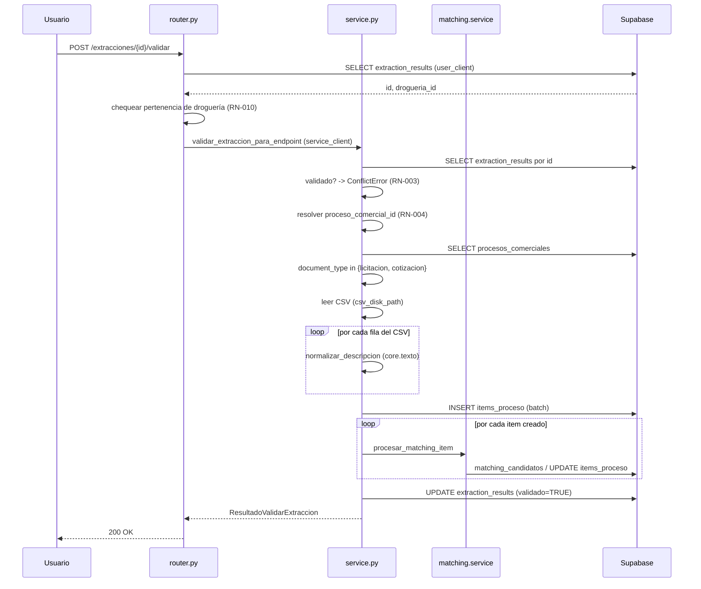
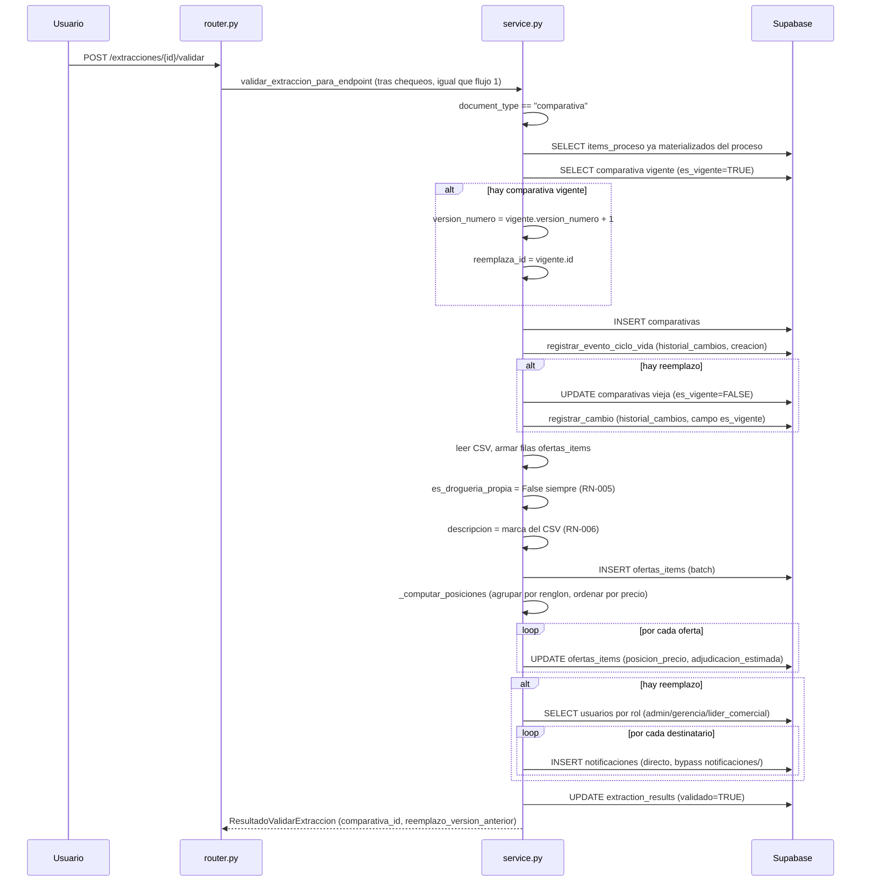

# Flujos — Extracción-Validación

## Flujo 1 — Validar licitación/cotización

Pasos, con evidencia de código:

1. El router verifica que la extracción exista y pertenezca a la droguería del
   usuario (`router.py:22-34`).
2. `validar_extraccion` busca la extracción por `id` (`service.py:251-253`,
   `NotFoundError` si no existe) y rechaza si ya está `validado`
   (`service.py:254-255`).
3. Resuelve `proceso_comercial_id` (`_resolver_proceso_comercial_id`,
   `service.py:257-259`, ver RN-EXTRACCIONVALIDACION-004) y vuelve a buscar el
   proceso comercial definitivo (`service.py:260-264`).
4. Como `document_type in {"licitacion", "cotizacion"}`, entra a
   `_materializar_licitacion` (`service.py:270-277`):
   a. Lee el CSV fuente con `csv.DictReader(delimiter=";")`
      (`_leer_filas_csv`, `service.py:24-26`).
   b. Por cada fila, arma un dict de `items_proceso` con `numero_renglon` (columna
      `item` del CSV), `descripcion`, `descripcion_normalizada`
      (`core.texto.normalizar_descripcion`) y `cantidad` (`service.py:71-84`).
   c. Inserta todas las filas en batch (`repo.insertar_items_proceso`,
      `service.py:86`).
   d. Por cada item creado, llama a `matching.service.procesar_matching_item`
      (`service.py:88-91`) — matching automático por alias de cliente o fuzzy
      contra el catálogo, según la lógica de `matching/service.py` (fuera del
      alcance de esta documentación, ver `arquitectura.md`).
5. Marca la extracción como validada (`validado=True`, `validado_por`,
   `validado_at`, `service.py:291-296`).
6. Retorna `ResultadoValidarExtraccion` con `filas_creadas` = cantidad de
   `items_proceso` insertados, `comparativa_id=None`,
   `reemplazo_version_anterior=False` (`service.py:298-305`).

## Flujo 2 — Validar comparativa

Pasos 1-3 idénticos al Flujo 1 (verificación de droguería, búsqueda de extracción,
resolución de `proceso_comercial_id`). A partir de ahí (`_materializar_comparativa`,
`service.py:137-241`):

4. Lee el CSV fuente (`service.py:145`).
5. Arma un mapa `numero_renglon -> item_proceso_id` a partir de los
   `items_proceso` ya materializados del mismo proceso comercial
   (`repo.listar_items_proceso_por_proceso`, `service.py:147-152`) — típicamente
   creados antes por el Flujo 1, sobre la extracción de licitación/cotización del
   mismo proceso.
6. Busca si hay una comparativa vigente para el proceso (`service.py:154-155`).
7. Arma la fila de `comparativas`: cuenta proveedores y renglones únicos del CSV
   (`service.py:157-158,164-165`); si hay reemplazo, agrega `version_numero`,
   `reemplaza_id`, `motivo_version` (`service.py:167-170`, ver
   RN-EXTRACCIONVALIDACION-007).
8. Inserta la comparativa (`service.py:172`) y registra el evento de creación en
   auditoría (`registrar_evento_ciclo_vida`, `service.py:173-181`).
9. Si hubo reemplazo: invalida la comparativa anterior (`service.py:184`) y
   registra el cambio de campo `es_vigente: True -> False` en auditoría
   (`registrar_cambio`, `service.py:185-196`, con un `batch_id` propio generado
   por `uuid.uuid4()`).
10. Por cada fila del CSV, arma la fila de `ofertas_items`: intenta vincular
    `item_proceso_id` por número de renglón (RN-EXTRACCIONVALIDACION-009),
    `es_drogueria_propia` siempre `False` (RN-EXTRACCIONVALIDACION-005),
    `descripcion` reusando la columna `marca` (RN-EXTRACCIONVALIDACION-006)
    (`service.py:201-222`).
11. Inserta todas las ofertas en batch (`service.py:224`).
12. Calcula posición de precio y adjudicación estimada por renglón
    (`_computar_posiciones`, ver RN-EXTRACCIONVALIDACION-008) y actualiza cada
    oferta creada (`service.py:226-231`).
13. Si hubo reemplazo, notifica a los roles `admin`/`gerencia`/`lider_comercial`
    (`_notificar_reemplazo_comparativa`, `service.py:233-239`, ver
    RN-EXTRACCIONVALIDACION-012) — con el bypass de `notificaciones/` documentado
    en [`arquitectura.md`](./arquitectura.md).
14. Marca la extracción como validada (igual que Flujo 1, `service.py:291-296`).
15. Retorna `ResultadoValidarExtraccion` con `comparativa_id`, `filas_creadas` =
    cantidad de `ofertas_items` insertadas, `reemplazo_version_anterior`
    (`service.py:298-305`).

## Flujo 3 — `document_type` no soportado

`document_type == "orden_compra"` (o cualquier otro valor fuera de las dos ramas
anteriores) corta el flujo inmediatamente después de resolver `proceso_comercial_id`,
sin tocar ninguna tabla de negocio: `ValidationError` (`service.py:286-289`, ver
RN-EXTRACCIONVALIDACION-002). La extracción **no** se marca como `validado` en este
caso — el `UPDATE` final (`service.py:292-296`) está después del branching y nunca se
alcanza.
