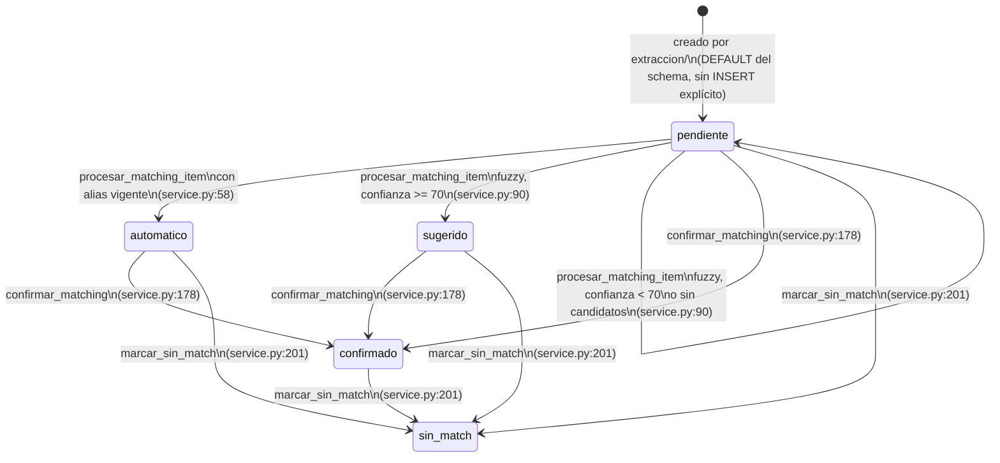

# Estados — `items_proceso.estado_matching`

A diferencia de Core (que no tiene `estados.md` porque no posee una máquina de
estados propia, ver [`../core/README.md`](../core/README.md)), Matching **sí**
gobierna un enum real con transiciones hechas cumplir en código:
`items_proceso.estado_matching`, columna `TEXT NOT NULL DEFAULT 'pendiente'`
(`docs/schema/extractor_final.sql:429`) con un `CHECK` de 5 valores
(`ck_ip_matching`, `docs/schema/extractor_final.sql:436-437`) que coincide
exactamente con `EstadoMatching` (`matching/models.py:6`):

```python
EstadoMatching = Literal["pendiente", "automatico", "sugerido", "confirmado", "sin_match"]
```

Comentario de schema (`docs/schema/extractor_final.sql:442`): "pendiente →
automatico (alias lo resolvió solo) / sugerido (IA propone, falta confirmar) →
confirmado / sin_match (no vendemos ese producto)."



## Quién crea la fila en `pendiente`

Ningún camino de `matching/` inserta filas en `items_proceso` — la tabla es
propiedad de `extraccion/` (`extraccion/repository.py:36-39`,
`insertar_items_proceso`). El `INSERT` de `extraccion/service.py:71-84` no escribe
`estado_matching` explícitamente, por lo que toda fila nace en `'pendiente'` por el
`DEFAULT` del schema. `extraccion/service.py:88-91` llama a
`procesar_matching_item` inmediatamente después de cada `INSERT`, por lo que en la
práctica una fila casi nunca queda observable en `'pendiente'` sin haber pasado ya
por el primer intento de matching — salvo que ese primer intento la deje en
`'pendiente'` de nuevo (fuzzy con confianza baja o sin candidatos).

## Transiciones sin guarda explícita

A diferencia de `extraction_results.validado` (documentado en
[`../extraccion_validacion/estados.md`](../extraccion_validacion/estados.md)), que
levanta `ConflictError` si se intenta validar dos veces, **ninguna** de las
transiciones de `estado_matching` tiene guarda de estado previo:

- `procesar_matching_item` no verifica el `estado_matching` actual del item antes de
  procesarlo — se le puede volver a llamar sobre un item ya `confirmado` o
  `sin_match` y sobreescribiría su estado según el resultado del alias/fuzzy de ese
  momento (no hay evidencia en el código de que algo impida esto; no se encontró
  ningún llamador de `procesar_matching_item` fuera de `extraccion/service.py`, que
  solo lo invoca una vez por item recién creado, así que el riesgo es teórico dado el
  único caller real conocido).
- `confirmar_matching` no verifica que el `estado_matching` sea `sugerido` o
  `automatico` antes de confirmar — puede confirmarse un item en cualquier estado,
  incluyendo uno ya `confirmado` (reconfirmar con otro `producto_id` es exactamente
  el mecanismo que dispara el versionado de alias de RN-MATCHING-005) o uno
  `sin_match` (reabrirlo con un matching manual).
- `marcar_sin_match` no verifica el `estado_matching` actual — puede marcarse sin
  match un item que ya estaba `confirmado`, sin ninguna validación adicional ni
  registro de por qué se revierte una confirmación previa.

## Estados terminales

No existe, en este módulo, ninguna función que revierta `confirmado` o `sin_match` a
`pendiente`. Ambos son alcanzables desde y hacia otros estados (`confirmado ->
sin_match` es posible vía `marcar_sin_match`, ver diagrama), pero no hay un camino de
código que reinicie el ciclo completo — "volver a pendiente" no es una operación
soportada, solo transiciones hacia adelante entre los 5 estados descritos arriba.
