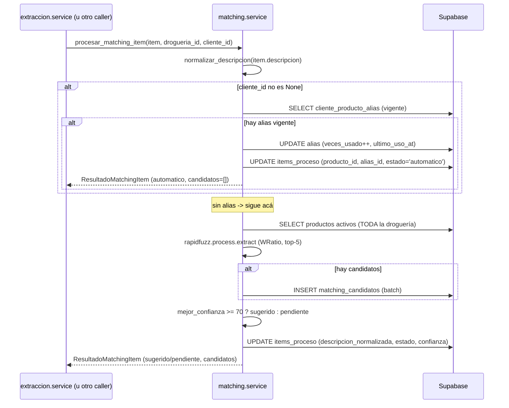
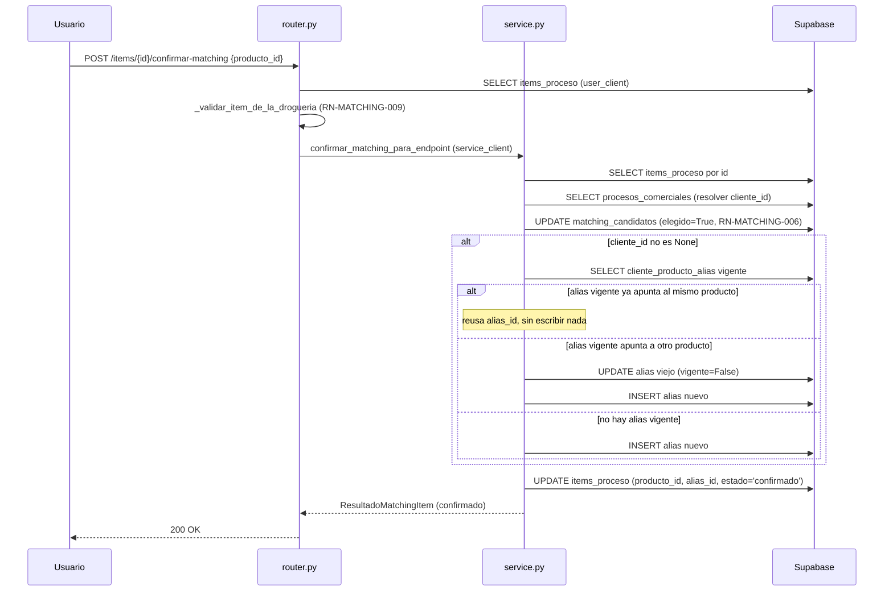

# Flujos — Matching

## Flujo 1 — `procesar_matching_item` (matching automático)

No tiene endpoint HTTP propio: lo dispara `extraccion/service.py:88-91` por cada
`item_proceso` recién creado al validar una licitación/cotización. También lo llaman
directo los tests de integración.

Pasos, con evidencia de código:

1. Normaliza la descripción del renglón (`normalizar_descripcion`, `service.py:43`)
   — mayúsculas, sin tildes ni puntuación (`core/texto.py:5-8`).
2. **Si `cliente_id is not None`** (RN-MATCHING-001): busca un alias vigente para
   `(cliente_id, descripcion_normalizada)` (`service.py:45-49`).
   - Si existe: incrementa `veces_usado`/`ultimo_uso_at` del alias
     (`service.py:50`), actualiza el item con `producto_id`/`alias_id` del alias,
     `estado_matching="automatico"`, `confianza_matching=None`
     (`service.py:51-61`), y retorna sin generar candidatos ni tocar
     `matching_candidatos` (`service.py:62-69`). **Fin del flujo.**
3. **Si no hubo alias** (o `cliente_id is None`): genera candidatos fuzzy
   (`_generar_candidatos`, `service.py:71-73`):
   a. Trae todos los productos `activo=True AND deleted_at IS NULL` de la droguería
      (`repo.listar_productos_activos`, `service.py:20`) — sin paginar, sin límite.
   b. Si no hay productos, retorna lista vacía (`service.py:21-22`).
   c. Arma un diccionario `{producto_id: nombre_normalizado}` (`service.py:24`) y
      corre `rapidfuzz.process.extract(descripcion_normalizada, choices,
      scorer=fuzz.WRatio, limit=5)` (`service.py:25-27`).
   d. Mapea cada resultado a `CandidatoMatching(metodo="fuzzy",
      detalle_scoring={"scorer": "WRatio"})` (`service.py:28-36`).
4. Si hubo al menos un candidato, los inserta en batch en `matching_candidatos`
   (`service.py:74-86`).
5. Calcula `mejor_confianza` (máximo de los candidatos, `None` si no hay ninguno,
   `service.py:88`) y decide `estado_matching` según el umbral de 70
   (RN-MATCHING-002, `service.py:89-91`).
6. Actualiza el item con `descripcion_normalizada`, `estado_matching`,
   `confianza_matching` (`service.py:93-101`) — **no** escribe `producto_id` ni
   `alias_id` en este camino, quedan como estaban (`None` si es la primera vez que se
   procesa el renglón).
7. Retorna `ResultadoMatchingItem` con `producto_id=None`, `alias_id=None`,
   `estado_matching`, `confianza_matching` y la lista de candidatos
   (`service.py:103-110`).

## Flujo 2 — `confirmar_matching` (confirmación humana)

Disparado por `POST /items/{item_id}/confirmar-matching`
(`confirmar_matching_endpoint`, `router.py:40-50`).

Pasos, con evidencia de código:

1. El router verifica que el item exista y pertenezca a la droguería del usuario
   (`router.py:47`, `_validar_item_de_la_drogueria`).
2. `confirmar_matching` busca el item por `id` (`service.py:147-149`,
   `NotFoundError` si no existe).
3. Resuelve el `proceso_comercial_id` del item y de ahí el `cliente_id`
   (`service.py:151-152`, `None` si el proceso no tiene cliente asociado o no se
   encuentra).
4. Marca el candidato elegido en `matching_candidatos` (`service.py:155`,
   RN-MATCHING-006) — antes de tocar alias, sin importar si esa fila existe.
5. Si hay `cliente_id`: resuelve `descripcion_normalizada` (reusa la del item si ya
   estaba seteada, si no la recalcula, `service.py:159-161`) y llama a
   `_upsert_alias` (`service.py:162-170`, RN-MATCHING-005) — reusa, invalida+crea, o
   crea, según el estado del alias vigente actual.
6. Actualiza el item con `producto_id` (el confirmado), `alias_id` (el resuelto por
   el paso anterior, o el que ya tenía si no hay `cliente_id`),
   `estado_matching="confirmado"` (`service.py:172-180`).
7. Retorna `ResultadoMatchingItem` con `confianza_matching` leída del item
   **actualizado** (la que había quedado del paso de sugerencia, si la hubo —
   `confirmar_matching` no la recalcula ni la borra, `service.py:182-188`).

## Flujo 3 — `marcar_sin_match`

Disparado por `POST /items/{item_id}/sin-match` (`sin_match_endpoint`,
`router.py:53-60`).

1. El router verifica pertenencia de droguería (`router.py:59`, mismo helper que el
   Flujo 2).
2. `marcar_sin_match` busca el item por `id` (`service.py:194-196`, `NotFoundError`
   si no existe).
3. `UPDATE items_proceso SET producto_id=NULL, estado_matching='sin_match'`
   (`service.py:198-201`) — no toca `alias_id`, `confianza_matching` ni
   `matching_candidatos` (RN-MATCHING-007).
4. Retorna `ResultadoMatchingItem` con `producto_id=None`, `alias_id` leído del item
   **antes** del `UPDATE` (`item.get("alias_id")`, `service.py:207`),
   `estado_matching="sin_match"`, `candidatos=[]`.
