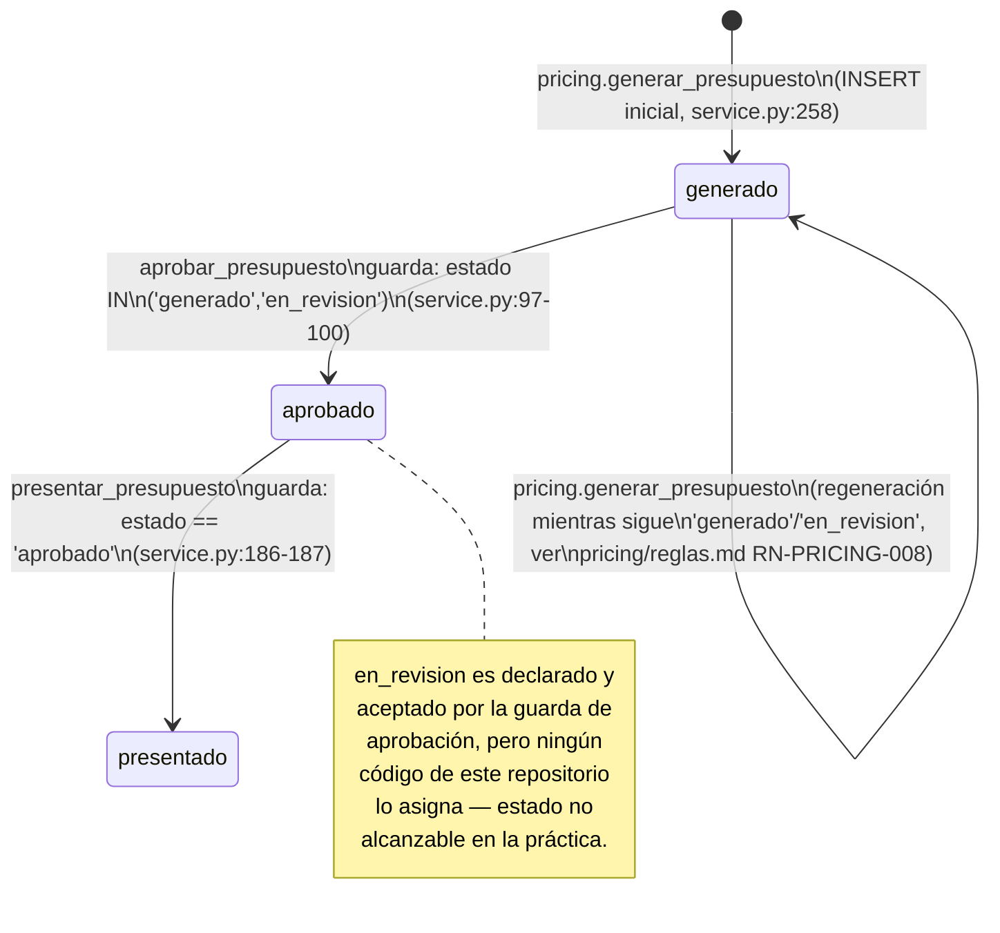

# Estados — `presupuestos.estado`

A diferencia de [`../procesos_comerciales/estados.md`](../procesos_comerciales/estados.md)
(que documenta una máquina de estados **nominal**, sin ninguna guarda de
transición en código), Presupuestos **sí** gobierna un enum con transiciones
efectivamente validadas por `service.py` — este es el primer módulo de
`presupuestacion/` documentado hasta ahora con guardas reales sobre su propio
campo `estado`.

## Los 7 valores declarados

`EstadoPresupuesto` (`models.py:6-8`):

```python
EstadoPresupuesto = Literal[
    "generado", "en_revision", "aprobado", "presentado", "adjudicado", "rechazado", "vencido"
]
```

Coincide exactamente con el `CHECK ck_pre_estado` de la base de datos
(`docs/schema/extractor_final.sql:509-510`):

```sql
CHECK (estado IN ('generado', 'en_revision', 'aprobado', 'presentado', 'adjudicado', 'rechazado', 'vencido'))
```

## Quién escribe cada valor — verificado por grep exhaustivo de `services/presupuestacion/`

De los 7 estados declarados, **solo 3 son alcanzables por código** en todo el
repositorio a la fecha de esta sesión:

| Estado | Quién lo escribe | Archivo:línea |
|---|---|---|
| `generado` | `pricing.generar_presupuesto`, al crear la fila (default de columna, además explícito en el `INSERT`) | `services/presupuestacion/pricing/service.py:258` |
| `en_revision` | **Nadie.** Ningún archivo de `services/presupuestacion/` asigna este valor (confirmado por grep de `"en_revision"` en todo el árbol: las únicas 3 apariciones son la declaración del `Literal` (`presupuestos/models.py:7`), la constante `_ESTADOS_APROBABLES` que lo **lee** como aprobable (`presupuestos/service.py:16`, `:99`) y el filtro `.in_("estado", [...])` de `pricing.buscar_presupuesto_abierto`, que también lo **lee** (`pricing/repository.py:151`)). | — |
| `aprobado` | `presupuestos.aprobar_presupuesto` | `presupuestos/service.py:114` |
| `presentado` | `presupuestos.presentar_presupuesto` | `presupuestos/service.py:225` |
| `adjudicado` | **Nadie.** 0 resultados de grep fuera de las 2 declaraciones de `Literal` (`presupuestos/models.py:7`; también existe como estado terminal, con otro significado, en `procesos_comerciales/models.py`, sin relación de código). | — |
| `rechazado` | **Nadie.** 0 resultados fuera de la declaración del `Literal`. | — |
| `vencido` | **Nadie.** 0 resultados fuera de la declaración del `Literal` y del `CHECK ck_pre_aprobado` (`extractor_final.sql:512`), que lo trata como estado especial que no requiere `aprobado_por`/`aprobado_at` — pero ningún código lo asigna jamás. | — |

[IMPLEMENTADO] — hallazgo confirmado por grep exhaustivo de `"en_revision"`,
`"adjudicado"`, `"rechazado"` y `"vencido"` sobre todo `services/presupuestacion/`
en esta sesión, no una omisión de lectura. Ver
[`pendientes.md`](./pendientes.md) P1 para el riesgo funcional de estos 4
estados "fantasma" (declarados, con al menos una constraint de base de datos que
los referencia, pero sin ningún camino de código que los produzca).

## Máquina de estados efectivamente alcanzable



`adjudicado`, `rechazado` y `vencido` no aparecen en el diagrama porque no son
alcanzables por ningún camino de código conocido en esta sesión — ver la tabla
anterior.

## Las dos guardas reales — a diferencia de `procesos_comerciales/`

### Guarda 1 — Aprobación: solo desde `generado` o `en_revision`

```python
_ESTADOS_APROBABLES = ("generado", "en_revision")
# service.py:16

if presupuesto["estado"] not in _ESTADOS_APROBABLES:
    raise ConflictError(
        "Solo se puede aprobar un presupuesto en estado 'generado' o 'en_revision'"
    )
```
`service.py:97-100` (RN-PRESUPUESTOS-001). Además de la guarda de estado, hay
una segunda condición de negocio superpuesta que también bloquea la aprobación:
no puede haber ítems `sin_precio` sin excluir (RN-PRESUPUESTOS-002,
`service.py:102-108`) — una guarda de **contenido**, no de estado, pero que
actúa como parte del mismo gate de transición.

### Guarda 2 — Presentación: solo desde `aprobado`

```python
if presupuesto["estado"] != "aprobado":
    raise ConflictError("Solo se puede presentar un presupuesto en estado 'aprobado'")
```
`service.py:186-187` (RN-PRESUPUESTOS-003). Esta es la guarda que
[`../procesos_comerciales/estados.md`](../procesos_comerciales/estados.md) ya
citó textualmente para contrastarla con la ausencia total de guarda sobre
`procesos_comerciales.estado` — confirmado con la misma cita exacta desde este
lado.

### Sin guarda de "regresión": nada impide re-aprobar tras una regeneración

Si `pricing.generar_presupuesto` regenera un presupuesto que sigue en
`"generado"`/`"en_revision"` (RN-PRICING-008,
[`../pricing/reglas.md`](../pricing/reglas.md)), el estado no cambia — la
regeneración no es una transición de `presupuestos.estado` en sí, solo
reemplaza `presupuesto_items`. No hay ningún camino de código, en ninguno de los
dos módulos, que lleve un presupuesto de vuelta a `"generado"`/`"en_revision"`
desde `"aprobado"` o `"presentado"` — las únicas dos transiciones son hacia
adelante (`generado → aprobado → presentado`).

## Comparación con `procesos_comerciales.estado`

| | `presupuestos.estado` (este módulo) | `procesos_comerciales.estado` |
|---|---|---|
| ¿Hay guarda de transición? | Sí, 2 guardas explícitas (`service.py:97-100`, `:186-187`) | No, ninguna (`procesos_comerciales/estados.md`) |
| ¿Quién escribe? | Este mismo módulo, dueño del campo | Otro módulo (`presupuestos/`), sin guarda |
| ¿Hay `CHECK` de base de datos? | Sí, `ck_pre_estado` (7 valores) y `ck_pre_aprobado` (RN-PRESUPUESTOS-018) | No verificado en esta sesión un `CHECK` de transición — solo el `CHECK` de valores válidos del enum, si existe |
| Estados declarados vs. alcanzables | 7 declarados, 3 alcanzables por código | 8 declarados, ninguno escrito dentro de `procesos_comerciales/` (el único write real, `"presentado"`, lo hace este módulo) |

Confirmado y enlazado desde
[`../procesos_comerciales/estados.md`](../procesos_comerciales/estados.md) y
[`../procesos_comerciales/pendientes.md`](../procesos_comerciales/pendientes.md)
P1(1)/P2(1): las guardas que **sí** existen acá sobre `presupuestos.estado`
**no protegen** el `UPDATE` de `procesos_comerciales.estado` que ocurre como
efecto colateral de `presentar_presupuesto` (RN-PRESUPUESTOS-007) — son dos
campos, en dos tablas, con niveles de rigor completamente distintos, escritos
por la misma función.
