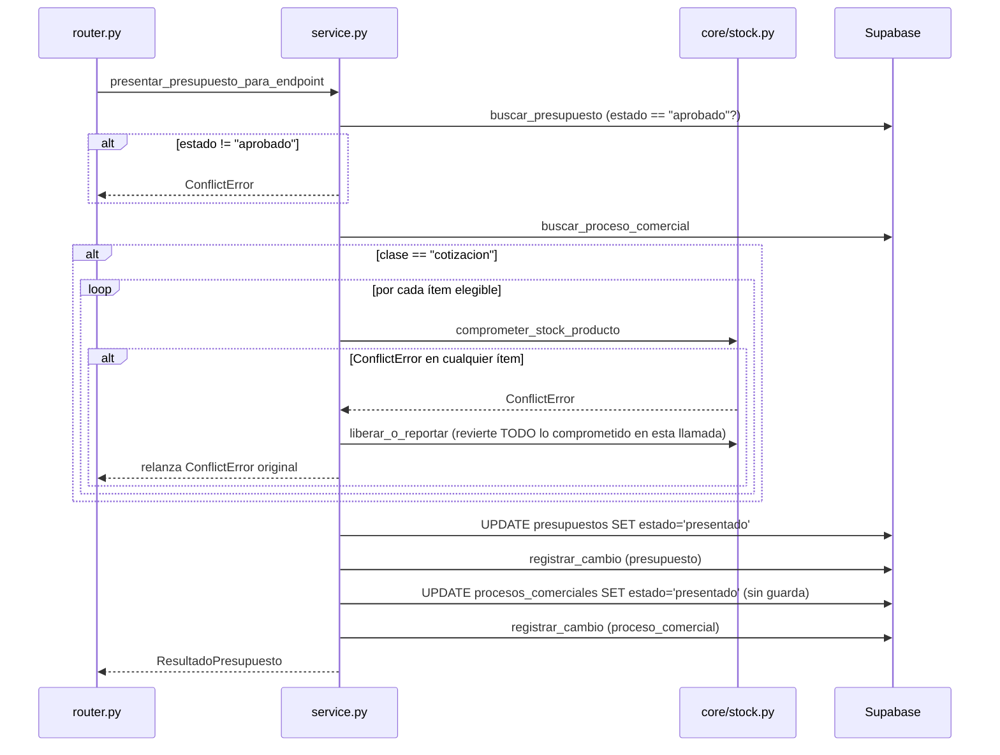

# Flujos — Presupuestos

Los 3 flujos principales del módulo. Cada paso cita `archivo:línea` verificado en
esta sesión.

## Flujo 1 — Aprobación (`POST /presupuestos/{id}/aprobar`)

1. El router exige `require_roles(*_ROLES_APROBAR)` — `("superadmin", "admin",
   "gerencia", "lider_comercial")` (`router.py:17`, `:82`). Nótese que
   `comercial` **no** puede aprobar, a diferencia de `_ROLES_AJUSTAR` y
   `_ROLES_PRESENTAR`, que sí lo incluyen (`router.py:18-19`) — coherente con el
   comentario del schema *"lider_comercial → [...] APRUEBA presupuestos"*
   (`docs/schema/rls_final.sql:10-11`).
2. `_validar_presupuesto_de_la_drogueria` (`router.py:24-39`) lee el presupuesto
   con `user_client` (RLS) y levanta `NotFoundError` si no existe o
   `ForbiddenError` si su `drogueria_id` no coincide con la del solicitante
   (salvo `superadmin`).
3. `aprobar_presupuesto_para_endpoint` resuelve `service_role` internamente
   (RN-PRESUPUESTOS-014) y delega en `aprobar_presupuesto`
   (`service.py:91-128`):
   1. Busca el presupuesto; `NotFoundError` si no existe (`service.py:94-96`).
   2. Guarda de estado: solo `"generado"`/`"en_revision"`, si no
      `ConflictError` (RN-PRESUPUESTOS-001, `service.py:97-100`).
   3. Trae todos los ítems del presupuesto y bloquea si hay alguno
      `sin_precio` no excluido (RN-PRESUPUESTOS-002, `service.py:102-108`).
   4. `UPDATE presupuestos SET estado='aprobado', aprobado_por=?,
      aprobado_at=NOW()` (`service.py:110-115`).
   5. Registra el cambio de estado en `historial_cambios`
      (`registrar_cambio`, entidad `"presupuesto"`, `service.py:116-127`).
   6. Devuelve `ResultadoPresupuesto` con el estado ya actualizado
      (`service.py:128`, `_resultado`).
4. El endpoint responde con `ResultadoPresupuesto`
   (`router.py:79`, `response_model=ResultadoPresupuesto`).

## Flujo 2 — Presentación (`POST /presupuestos/{id}/presentar`)

El flujo más complejo del módulo — compromiso condicional de stock con
reversión ante fallo parcial. Ver también [`../core/flujo.md`](../core/flujo.md)
Flujo A, documentado desde el lado de Core y confirmado desde este lado en
[`arquitectura.md`](./arquitectura.md).

1. El router exige `require_roles(*_ROLES_PRESENTAR)` — `("superadmin", "admin",
   "gerencia", "lider_comercial", "comercial")` (`router.py:19`, `:92`).
2. `_validar_presupuesto_de_la_drogueria` (`router.py:24-39`), igual que en el
   Flujo 1.
3. `presentar_presupuesto_para_endpoint` resuelve `service_role`
   (RN-PRESUPUESTOS-015) y delega en `presentar_presupuesto`
   (`service.py:180-255`):
   1. Busca el presupuesto; `NotFoundError` si no existe
      (`service.py:183-185`).
   2. Guarda de estado: solo `"aprobado"`, si no `ConflictError`
      (RN-PRESUPUESTOS-003, `service.py:186-187`).
   3. Busca el proceso comercial asociado; `NotFoundError` si no existe
      (`service.py:189-193`).
   4. **Si `proceso["clase"] == "cotizacion"`** (RN-PRESUPUESTOS-004,
      `service.py:195`):
      1. Filtra los ítems elegibles para comprometer: no excluidos, con
         `producto_id` y `cantidad_ofertada` definidos (RN-PRESUPUESTOS-005,
         `service.py:196-201`).
      2. Por cada ítem elegible, llama a `stock.comprometer_stock_producto`
         y acumula los compromisos en `compromisos_totales`
         (`service.py:203-212`).
      3. Si `comprometer_stock_producto` levanta `ConflictError` para
         cualquier ítem (sin stock suficiente o contención agotando
         reintentos), revierte **todos** los compromisos acumulados hasta
         ese punto (`stock.liberar_o_reportar`) y relanza la excepción
         original (RN-PRESUPUESTOS-006, `service.py:213-219`) — el
         presupuesto no avanza de estado, ningún ítem queda con stock
         comprometido a medias.
   5. Si no hubo excepción (o el proceso es una licitación, sin paso 4):
      `UPDATE presupuestos SET estado='presentado', presentado_por=?,
      presentado_at=NOW()` (`service.py:221-226`).
   6. Registra el cambio de estado del presupuesto en `historial_cambios`
      (`service.py:227-238`).
   7. `UPDATE procesos_comerciales SET estado='presentado'` — sin guarda
      sobre el estado anterior del proceso (RN-PRESUPUESTOS-007,
      `service.py:239-241`).
   8. Registra el cambio de estado del proceso comercial en
      `historial_cambios`, con `valor_anterior=proceso["estado"]`
      (`service.py:242-253`) — el mismo `proceso["estado"]` leído en el
      paso 3, usado únicamente como dato de auditoría, no como condición.
   9. Devuelve `ResultadoPresupuesto` (`service.py:255`).
4. El endpoint responde con `ResultadoPresupuesto`
   (`router.py:89`, `response_model=ResultadoPresupuesto`).

## Flujo 3 — Ajuste manual de un ítem (`PATCH /presupuesto-items/{id}`)

1. El router exige `require_roles(*_ROLES_AJUSTAR)` — `("superadmin", "admin",
   "gerencia", "lider_comercial", "comercial")` (`router.py:18`, `:103`) — el
   único rol que puede ajustar sin poder aprobar es `comercial`.
2. `_validar_item_de_la_drogueria` (`router.py:42-57`) valida pertenencia con
   `user_client`, igual que en los otros dos endpoints pero sobre
   `presupuesto_items`.
3. `ajustar_item_para_endpoint` resuelve `service_role`
   (RN-PRESUPUESTOS-014) y delega en `ajustar_item` (`service.py:131-177`):
   1. Busca el ítem; `NotFoundError` si no existe (`service.py:141-143`).
   2. **Rama precio** (si `precio_unitario is not None`,
      `service.py:146-157`): guarda `precio_original_motor` solo si aún es
      `NULL` (RN-PRESUPUESTOS-008); fija `precio_unitario`,
      `precio_ajustado_por`, `metodo_precio="manual"`; recalcula
      `margen_resultante_pct` contra `costo_usado` con guarda de división
      por cero (RN-PRESUPUESTOS-009).
   3. **Rama cantidad** (si `cantidad_ofertada is not None`,
      `service.py:159-160`): fija `cantidad_ofertada` sin ningún efecto
      adicional propio.
   4. **Rama exclusión** (si `excluido is not None`, `service.py:162-164`):
      fija `excluido` y `motivo_exclusion` juntos, incluso si
      `motivo_exclusion` es `None`.
   5. Si ninguna de las tres ramas aportó campos, `ValidationError`
      (RN-PRESUPUESTOS-010, `service.py:166-167`).
   6. `UPDATE presupuesto_items` con solo los campos calculados
      (`service.py:169-171`).
   7. Busca el presupuesto padre y, si existe, dispara
      `_recalcular_totales_presupuesto` (`service.py:173-175`) —
      RN-PRESUPUESTOS-011/012.
   8. Devuelve la fila actualizada de `presupuesto_items` como `dict`
      crudo (`service.py:177`) — no hay un `BaseModel` de salida propio
      para este endpoint (`router.py:105`, tipo de retorno `dict`).
4. El endpoint responde con el `dict` sin `response_model` explícito
   (`router.py:99-114`).

No hay guarda de estado del presupuesto en `ajustar_item`: un ítem puede
ajustarse en cualquier estado del presupuesto padre (`generado`, `en_revision`,
`aprobado`, `presentado`, o cualquier otro), incluyendo después de haberse
presentado al cliente y comprometido stock real. Ver
[`pendientes.md`](./pendientes.md) para el riesgo asociado.
